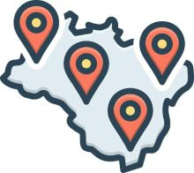
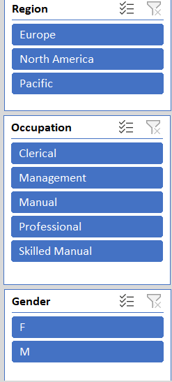

# 🚴 Bike Purchase Analysis Dashboard

## 📖 Overview

The **Bike Purchase Analysis Dashboard** is an interactive **Power BI** project that analyzes customer purchasing behavior based on demographic information. The dashboard enables users to explore bike purchase trends through dynamic visualizations and interactive filters.

---

## 🖼️ Dashboard Preview

  

---

## 🎯 Objectives

- Analyze total bike purchases.
- Compare purchases between male and female customers.
- Identify the highest purchasing region.
- Study purchase behavior by education level.
- Analyze customer marital status.
- Enable interactive filtering for better decision-making.

---

## 📊 Dashboard KPIs

| KPI | Value |
|------|-------|
| 🚴 Total Bikes Purchased | **1026** |
| 👨 Male Purchasers | **525** |
| 👩 Female Purchasers | **501** |

---

## 📈 Dashboard Insights

### 👨 Gender Analysis

  

- Male customers purchased slightly more bikes than female customers.
- Male Purchasers: **525**
- Female Purchasers: **501**

---

### 🌍 Region Analysis

  

| Region | Purchases |
|---------|----------:|
| 🌎 North America | 508 |
| 🌍 Europe | 316 |
| 🌏 Pacific | 202 |

**Insight:** North America records the highest bike purchases.

---

### 🎓 Education Analysis

  

| Education | Purchases |
|------------|----------:|
| 🎓 Bachelors | 311 |
| 📚 Partial College | 278 |
| 🏫 High School | 184 |
| 🎓 Graduate Degree | 175 |
| 📖 Partial High School | 78 |

**Insight:** Customers with Bachelor's and Partial College education contribute the most bike purchases.

---

### 💍 Marital Status

  

| Status | Percentage |
|--------|-----------:|
| 💍 Married | 54% |
| 🧍 Single | 46% |

**Insight:** Married customers have a slightly higher bike purchase rate.

---

## 🎛️ Interactive Filters

  

The dashboard includes slicers for:

- 🌍 Region
- 💼 Occupation
- 👨 Gender
- 🎓 Education
- 🚴 Purchased Bike
- 💍 Marital Status

---

## 📌 Dashboard Features

- 📊 KPI Cards
- 📈 Line Chart
- 📉 Bar Chart
- 🥧 Pie Chart
- 🎛️ Interactive Slicers
- 📂 Dynamic Filtering
- ⚡ Fast Data Exploration

---

## 🛠️ Tools & Technologies

- ⚡ Power BI Desktop
- 📊 DAX
- 🔄 Power Query
- 📂 Microsoft Excel
- 📈 Data Visualization

---

## 💡 Key Business Insights

- 🌎 North America has the highest bike purchase count.
- 👨 Male customers purchase slightly more bikes than females.
- 🎓 Bachelor's degree holders are the top buyers.
- 💍 Married customers have a higher purchase percentage.
- 🎛️ Interactive filters make demographic analysis easy.

## 🚀 Future Enhancements

- 📅 Time-Series Analysis
- 💰 Income Analysis
- 👶 Age Group Analysis
- 🤖 Predictive Analytics
- 📱 Mobile Dashboard Layout

## 👨‍💻 Author

**Prachi Sharma**

GitHub: https://github.com/Prachisharmaa1/Bike-Purchase

LinkedIn: www.linkedin.com/in/prachi-sharma-11831330b
